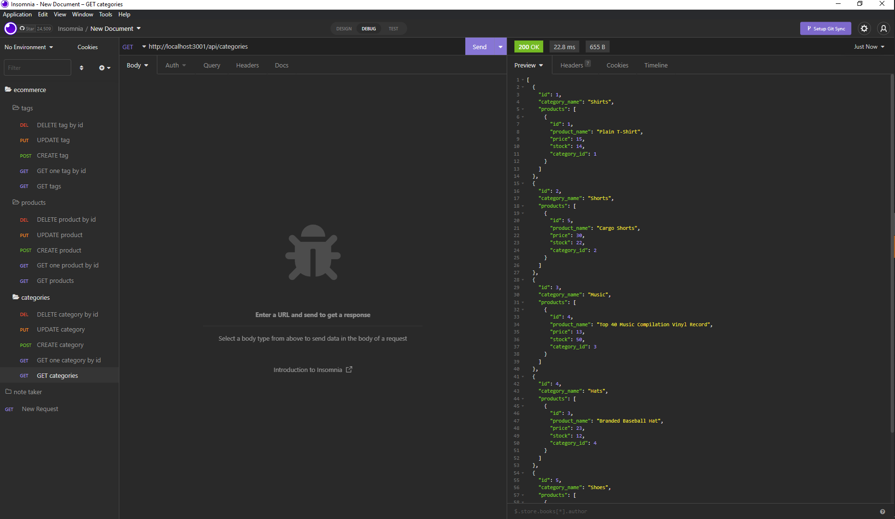

# <E-commerce back end>

## Description

Using sequelize, an express server was made to interact with a MySQL database. This will allow the user to be able to sort through their inventory to obtain item details and item stock.

## Installation

User will need insomnia. User can use "npm i" to install the necessary node modules to get the server running and use insomnia to see where the linked routes will take them. 

## Usage

User can go through the GET, POST, PUT, and DELETE routes on insomnia to obtain, add, edit, and remove items. Application can be used to keep track and sort a store's inventory.

Video example of how the application works in insomnia: https://drive.google.com/file/d/1NoblKT0xrU_JG1Kms1sNhh3xmu3v0Pvk/view
Provide instructions and examples for use. Include screenshots as needed.

## Credits
The following sequelize docs were referenced when writing the models.
https://sequelize.org/docs/v6/core-concepts/model-basics/#default-values
https://sequelize.org/docs/v6/core-concepts/model-querying-basics/#simple-select-queries
https://sequelize.org/docs/v6/core-concepts/validations-and-constraints/